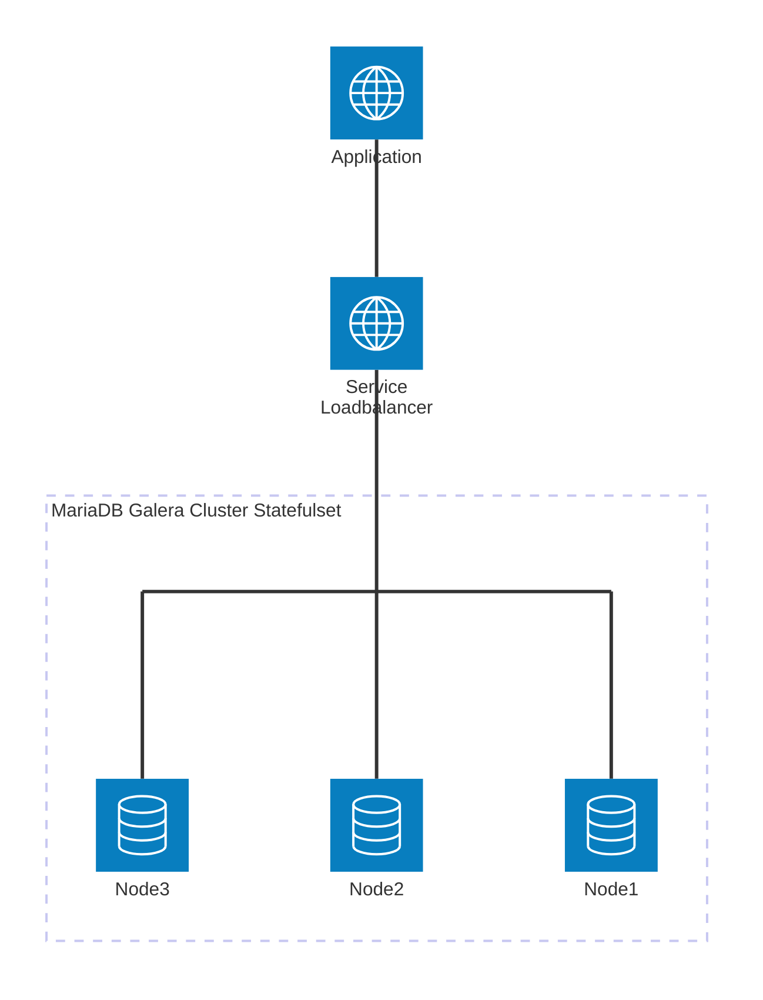

# Galera Cluster with MariaDB

This document provides detailed instructions and best practices for deploying and managing a MariaDB Galera Cluster using the Helm chart available in this repository. Galera Cluster is a synchronous multi-master replication solution for MariaDB, providing high availability and scalability.




### Galera Cluster Setup

#### Basic Galera Cluster

Deploy a 3-node Galera cluster with automatic bootstrap:

```yaml
galera:
  enabled: true
  name: "mycluster"
  replicaCount: 3
  bootstrap:
    enabled: true

auth:
  rootPassword: "mySecurePassword"
  database: "mydatabase"
  username: "myuser"
  password: "myUserPassword"
```

#### Production Galera Setup

```yaml
galera:
  enabled: true
  name: "production-cluster"
  replicaCount: 3
  wsrepSlaveThreads: 4
  sst:
    user: "sstuser"
    password: "secureSST_Password"
  innodb:
    flushLogAtTrxCommit: 2
    bufferPoolSize: "2G"

auth:
  rootPassword: "verySecureRootPassword"
  database: "production_db"
  username: "app_user"
  password: "secureUserPassword"

# Pod anti-affinity for spreading nodes across different hosts
affinity:
  podAntiAffinity:
    preferredDuringSchedulingIgnoredDuringExecution:
    - weight: 100
      podAffinityTerm:
        labelSelector:
          matchLabels:
            app.kubernetes.io/name: mariadb
        topologyKey: kubernetes.io/hostname
```

#### Galera with Existing SST Secret

```yaml
galera:
  enabled: true
  name: "secure-cluster"
  replicaCount: 3
  sst:
    existingSecret: "galera-sst-credentials"
    secretKeys:
      userKey: "sst-user"
      passwordKey: "sst-password"

# Create the secret separately:
# kubectl create secret generic galera-sst-credentials \
#   --from-literal=sst-user=sstuser \
#   --from-literal=sst-password=your-secure-password
```

#### Cluster Recovery

For cluster recovery scenarios, you may need to force bootstrap:

```yaml
galera:
  enabled: true
  forceSafeToBootstrap: true  # Use only in recovery scenarios
  recovery:
    enabled: true
    clusterBootstrap: true
```

#### Connecting to Galera Cluster

Connect to the cluster through the main service (load balanced):

```bash
kubectl exec -it pod/mdb-mariadb-0  -- mariadb -uroot -p$MARIADB_ROOT_PASSWORD -e \"SHOW GLOBAL STATUS LIKE 'wsrep_cluster%'\"
```


#### Galera Cluster Monitoring

Check cluster status inside the database:

```sql
SHOW STATUS LIKE 'wsrep_ready';
SHOW STATUS LIKE 'wsrep_cluster_size';
SHOW STATUS LIKE 'wsrep_local_state_comment';
```

Key status variables to monitor:
- `wsrep_cluster_size`: Number of nodes in cluster
- `wsrep_local_state_comment`: Should be "Synced" for healthy nodes
- `wsrep_ready`: Should be "ON" for ready nodes

### Galera Cluster Troubleshooting

#### Check Cluster Status

1. **Verify all nodes are running**:
   ```bash
   kubectl get pods -l app.kubernetes.io/name=mariadb
   kubectl get statefulset -l app.kubernetes.io/name=mariadb
   ```

2. **Check cluster status from database**:
   ```bash
   kubectl exec -it <pod-name> -- mysql -uroot -p<password> -e "SHOW STATUS LIKE 'wsrep_%'"
   ```

3. **Check individual node status**:
   ```sql
   SHOW STATUS LIKE 'wsrep_local_state_comment';  -- Should show "Synced"
   SHOW STATUS LIKE 'wsrep_cluster_size';         -- Should show total node count
   SHOW STATUS LIKE 'wsrep_ready';                -- Should be "ON"
   ```

4. **Check logs for errors**:
   ```bash
   kubectl exec <pod-name> -- tail -n 300 /var/lib/mysql/mariabackup.backup.log
   ```

5. **Check SST user permissions**:
   ```bash
   SHOW GRANTS FOR 'sstuser'@'%'; grep wsrep_sst_auth
   ```

   expected output:
   ```sql
   GRANT RELOAD, LOCK TABLES, PROCESS, REPLICATION CLIENT ON *.* TO 'sstuser'@'%';
   GRANT ALL PRIVILEGES ON *.* TO 'sstuser'@'localhost';
   ```

#### Common Issues and Solutions

1. **Cluster won't start (split-brain scenario)**:
   ```bash
   # Check grastate.dat on all nodes
   kubectl exec <pod-name> -- cat /var/lib/mysql/grastate.dat
   
   # Force bootstrap on the most advanced node
   helm upgrade <release-name> charts/mariadb --set galera.forceSafeToBootstrap=true
   # After cluster starts, disable force bootstrap
   helm upgrade <release-name> charts/mariadb --set galera.forceSafeToBootstrap=false
   ```

2. **Node stuck in joining state**:
   ```bash
   # Check SST logs
   kubectl logs <pod-name> | grep -i sst
   
   # Verify SST user credentials
   kubectl get secret <release-name>-mariadb-galera -o yaml
   ```

3. **Slow state transfers**:
   ```yaml
   galera:
     wsrepMethod: "mariabackup"  # Faster than mysqldump
     innodb:
       bufferPoolSize: "2G"      # Increase buffer pool
   ```

4. **Network connectivity issues**:
   ```bash
   # Test connectivity between pods
   kubectl exec <pod-1> -- nc -zv <pod-2-fqdn> 4567
   kubectl exec <pod-1> -- nc -zv <pod-2-fqdn> 4568
   kubectl exec <pod-1> -- nc -zv <pod-2-fqdn> 4444
   ```

5. **Recovery from complete cluster shutdown**:
   ```bash
   # Find the most advanced node (highest seqno)
   kubectl exec <pod-name> -- cat /var/lib/mysql/grastate.dat
   
   # Set safe_to_bootstrap=1 on the most advanced node
   kubectl exec <pod-name> -- sed -i 's/safe_to_bootstrap: 0/safe_to_bootstrap: 1/' /var/lib/mysql/grastate.dat
   
   # Or use force bootstrap flag
   helm upgrade <release-name> charts/mariadb --set galera.forceSafeToBootstrap=true
   ```

#### Galera Best Practices

- **Always use odd number of nodes** (3, 5, 7) to avoid split-brain
- **Enable pod anti-affinity** to spread nodes across different hosts
- **Monitor cluster size** regularly to detect node failures
- **Use dedicated storage** with good I/O performance
- **Configure proper resource limits** based on your workload
- **Regular backups** are essential even with clustering
- **Test recovery procedures** in non-production environments