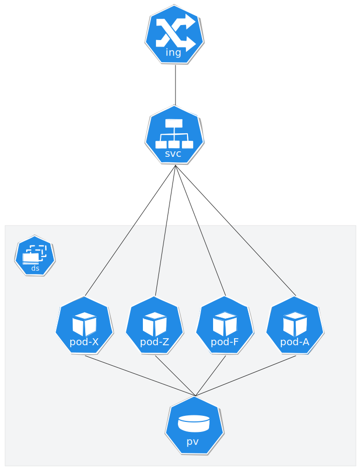
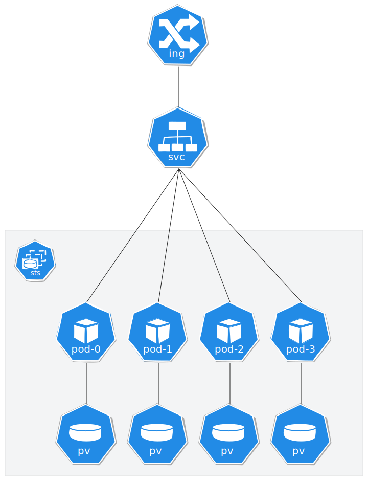

# RustFS

A Helm chart for RustFS - High-performance distributed file system written in Rust with S3-compatible API. RustFS is a modern, efficient file system that provides S3-compatible APIs for cloud-native applications.

> [!WARNING]  
> RustFS is currently in ALPHA stage. It is not recommended for production use by the publisher.

## Prerequisites

- Kubernetes 1.19+
- Helm 3.2.0+
- PV provisioner support in the underlying infrastructure (if persistence is enabled)


## Modes
RustFS can be deployed in two modes:

1. **Deployment Mode**: In this mode, RustFS is deployed as a standard Kubernetes Deployment. This mode is suitable for high load scenarios where stateless operation is acceptable. This deployment mode requires mounting persistent volumes in read-write-many (RWX) mode to ensure data persistence across pod restarts.

<p align="center"></p>

2. **StatefulSet Mode**: In this mode, RustFS is deployed as a StatefulSet. This mode is ideal for scenarios where data consistency and persistence are critical. Each pod in the StatefulSet has a unique identity and stable storage, making it suitable for stateful applications.

<p align="center"></p>


## Installing the Chart

To install the chart with the release name `my-rustfs`:

```bash
helm install my-rustfs oci://registry-1.docker.io/cloudpirates/rustfs
```

To install with custom values:

```bash
helm install my-rustfs oci://registry-1.docker.io/cloudpirates/rustfs -f my-values.yaml
```

Or install directly from the local chart:

```bash
helm install my-rustfs ./charts/rustfs
```

The command deploys RustFS on the Kubernetes cluster in the default configuration. The [Configuration](#configuration) section lists the parameters that can be configured during installation.

## Uninstalling the Chart

To uninstall/delete the `my-rustfs` deployment:

```bash
helm uninstall my-rustfs
```

The command removes all the Kubernetes components associated with the chart and deletes the release.

## Security & Signature Verification

This Helm chart is cryptographically signed with Cosign to ensure authenticity and prevent tampering.

**Public Key:**

```
-----BEGIN PUBLIC KEY-----
MFkwEwYHKoZIzj0CAQYIKoZIzj0DAQcDQgAE7BgqFgKdPtHdXz6OfYBklYwJgGWQ
mZzYz8qJ9r6QhF3NxK8rD2oG7Bk6nHJz7qWXhQoU2JvJdI3Zx9HGpLfKvw==
-----END PUBLIC KEY-----
```

To verify the helm chart before installation, copy the public key to the file `cosign.pub` and run cosign:

```bash
cosign verify --key cosign.pub registry-1.docker.io/cloudpirates/rustfs:<version>
```

## Configuration

The following table lists the configurable parameters of the RustFS chart and their default values.

### Global parameters

| Parameter                 | Description                                     | Default |
| ------------------------- | ----------------------------------------------- | ------- |
| `global.imageRegistry`    | Global Docker image registry                    | `""`    |
| `global.imagePullSecrets` | Global Docker registry secret names as an array | `[]`    |

### Common parameters

| Parameter            | Description                             | Default |
| -------------------- | --------------------------------------- | ------- |
| `nameOverride`       | String to partially override rustfs.fullname | `""`    |
| `fullnameOverride`   | String to fully override rustfs.fullname     | `""`    |
| `commonLabels`       | Labels to add to all deployed objects        | `{}`    |
| `commonAnnotations`  | Annotations to add to all deployed objects   | `{}`    |

### RustFS image configuration

| Parameter               | Description                                   | Default           |
| ----------------------- | --------------------------------------------- | ----------------- |
| `image.registry`        | RustFS image registry                         | `docker.io`       |
| `image.repository`      | RustFS image repository                       | `rustfs/rustfs`   |
| `image.tag`             | RustFS image tag (immutable tags are recommended) | `"latest"`        |
| `image.imagePullPolicy` | RustFS image pull policy                      | `Always`          |

### RustFS Authentication

| Parameter                          | Description                                                        | Default           |
| ---------------------------------- | ------------------------------------------------------------------ | ----------------- |
| `auth.accessKey`                   | RustFS access key                                                  | `"rustfsadmin"`   |
| `auth.secretKey`                   | RustFS secret key. If not set, a random password will be generated | `""`              |
| `auth.existingSecret`              | Name of existing secret containing RustFS credentials             | `""`              |
| `auth.existingSecretAccessKeyKey`  | Key in existing secret containing access key                      | `"access-key"`    |
| `auth.existingSecretSecretKeyKey`  | Key in existing secret containing secret key                      | `"secret-key"`    |

### RustFS configuration

| Parameter                         | Description                           | Default                |
| --------------------------------- | ------------------------------------- | ---------------------- |
| `config.volumes`                  | RustFS storage volumes configuration  | `"/data/rustfs{0..3}"` |
| `config.address`                  | RustFS server address                 | `"0.0.0.0:9000"`       |
| `config.consoleAddress`           | RustFS console address                | `"0.0.0.0:9001"`       |
| `config.consoleEnabled`           | Enable RustFS console                 | `true`                 |
| `config.externalAddress`          | RustFS external address               | `":9000"`              |
| `config.corsAllowedOrigins`       | CORS allowed origins for API          | `"*"`                  |
| `config.consoleCorsAllowedOrigins` | CORS allowed origins for console     | `"*"`                  |
| `config.logLevel`                 | RustFS log level (trace, debug, info, warn, error) | `"info"`               |
| `config.tlsPath`                  | Path to TLS certificates              | `"/opt/tls"`           |
| `config.extraEnvVars`             | Extra environment variables           | `[]`                   |

### Deployment configuration

| Parameter      | Description           | Default |
| -------------- | --------------------- | ------- |
| `replicaCount` | Number of replicas    | `4`     |

### Deployment type configuration

| Parameter                           | Description                                      | Default          |
| ----------------------------------- | ------------------------------------------------ | ---------------- |
| `deploymentType`                    | Type of deployment (deployment or statefulset)  | `"deployment"`   |
| `updateStrategy.type`               | Update strategy for StatefulSet                  | `RollingUpdate`  |
| `updateStrategy.rollingUpdate.partition` | Partition for RollingUpdate (StatefulSet only)  | `0`              |
| `podManagementPolicy`               | Pod management policy for StatefulSet (Parallel or OrderedReady) | `"Parallel"`     |

### Pod annotations and labels

| Parameter        | Description            | Default |
| ---------------- | ---------------------- | ------- |
| `podAnnotations` | Pod annotations        | `{}`    |
| `podLabels`      | Pod labels             | `{}`    |

### Security Context

| Parameter                                    | Description                                      | Default |
| -------------------------------------------- | ------------------------------------------------ | ------- |
| `podSecurityContext.fsGroup`                 | Group ID for the volumes of the pod             | `1001`  |
| `containerSecurityContext.allowPrivilegeEscalation` | Enable container privilege escalation           | `false` |
| `containerSecurityContext.runAsNonRoot`     | Configure the container to run as a non-root user | `true`  |
| `containerSecurityContext.runAsUser`        | User ID for the RustFS container                | `1001`  |
| `containerSecurityContext.runAsGroup`       | Group ID for the RustFS container               | `1001`  |
| `containerSecurityContext.readOnlyRootFilesystem` | Mount container root filesystem as read-only    | `false` |
| `containerSecurityContext.capabilities.drop` | Linux capabilities to be dropped                | `["ALL"]` |

### Service configuration

| Parameter              | Description                  | Default     |
| ---------------------- | ---------------------------- | ----------- |
| `service.type`         | RustFS service type          | `ClusterIP` |
| `service.port`         | RustFS API service port      | `9000`      |
| `service.consolePort`  | RustFS console service port  | `9001`      |
| `service.annotations`  | Service annotations          | `{}`        |

### Console Service configuration (for StatefulSet only)

| Parameter                           | Description                                      | Default     |
| ----------------------------------- | ------------------------------------------------ | ----------- |
| `consoleService.enabled`            | Enable Console service that routes to the first pod only | `true`      |
| `consoleService.type`               | Console service type                             | `ClusterIP` |
| `consoleService.port`               | Console service API port                         | `9000`      |
| `consoleService.consolePort`        | Console service console port                     | `9001`      |
| `consoleService.sessionAffinityTimeout` | Session affinity timeout in seconds          | `10800`     |
| `consoleService.annotations`        | Console service annotations                      | `{}`        |

### Ingress configuration

| Parameter                      | Description                                   | Default           |
| ------------------------------ | --------------------------------------------- | ----------------- |
| `ingress.enabled`              | Enable ingress record generation for RustFS API | `false`           |
| `ingress.className`            | IngressClass that will be used to implement the Ingress | `""`              |
| `ingress.annotations`          | Additional annotations for the Ingress resource | `{}`              |
| `ingress.hosts[0].host`        | Hostname for RustFS API ingress              | `rustfs.local`    |
| `ingress.hosts[0].paths[0].path` | Path for RustFS API ingress                   | `/`               |
| `ingress.hosts[0].paths[0].pathType` | Path type for RustFS API ingress              | `Prefix`          |
| `ingress.tls`                  | TLS configuration for RustFS API ingress     | `[]`              |

### Console Ingress configuration (for StatefulSet only)

| Parameter                           | Description                                                     | Default                    |
| ----------------------------------- | --------------------------------------------------------------- | -------------------------- |
| `consoleIngress.enabled`            | Enable Console ingress record generation for RustFS API (routes to first pod only) | `true`                     |
| `consoleIngress.className`          | IngressClass that will be used to implement the Console Ingress | `""`                       |
| `consoleIngress.annotations`        | Additional annotations for the Console Ingress resource         | `{}`                       |
| `consoleIngress.hosts[0].host`      | Hostname for Console RustFS API ingress                         | `rustfs-console.localhost` |
| `consoleIngress.hosts[0].paths[0].path` | Path for Console RustFS API ingress                         | `/`                        |
| `consoleIngress.hosts[0].paths[0].pathType` | Path type for Console RustFS API ingress                | `Prefix`                   |
| `consoleIngress.tls`                | TLS configuration for Console RustFS API ingress                | `[]`                       |

### Resources

| Parameter   | Description                        | Default |
| ----------- | ---------------------------------- | ------- |
| `resources` | Resource limits and requests       | `{}`    |

### Data Persistence

| Parameter                          | Description                                       | Default      |
| ---------------------------------- | ------------------------------------------------- | ------------ |
| `dataPersistence.enabled`          | Enable data persistence using Persistent Volume Claims | `true`       |
| `dataPersistence.storageClass`     | Persistent Volume storage class for data         | `""`         |
| `dataPersistence.annotations`      | Persistent Volume Claim annotations for data     | `{}`         |
| `dataPersistence.size`             | Persistent Volume size for data                  | `10Gi`       |
| `dataPersistence.accessModes`      | Persistent Volume access modes for data          | `["ReadWriteOnce"]` |
| `dataPersistence.existingClaim`    | The name of an existing PVC to use for data persistence | `""`         |
| `dataPersistence.mountPath`        | The path where to mount the data volume          | `/data`      |

### Logs Persistence

| Parameter                          | Description                                       | Default      |
| ---------------------------------- | ------------------------------------------------- | ------------ |
| `logsPersistence.enabled`          | Enable logs persistence using Persistent Volume Claims | `true`       |
| `logsPersistence.storageClass`     | Persistent Volume storage class for logs         | `""`         |
| `logsPersistence.annotations`      | Persistent Volume Claim annotations for logs     | `{}`         |
| `logsPersistence.size`             | Persistent Volume size for logs                  | `1Gi`        |
| `logsPersistence.accessModes`      | Persistent Volume access modes for logs          | `["ReadWriteOnce"]` |
| `logsPersistence.existingClaim`    | The name of an existing PVC to use for logs persistence | `""`         |
| `logsPersistence.mountPath`        | The path where to mount the logs volume          | `/app/logs`  |

### TLS Persistence

| Parameter                          | Description                                       | Default      |
| ---------------------------------- | ------------------------------------------------- | ------------ |
| `tlsPersistence.enabled`           | Enable TLS persistence using Persistent Volume Claims | `false`      |
| `tlsPersistence.storageClass`      | Persistent Volume storage class for TLS          | `""`         |
| `tlsPersistence.annotations`       | Persistent Volume Claim annotations for TLS      | `{}`         |
| `tlsPersistence.size`              | Persistent Volume size for TLS                   | `100Mi`      |
| `tlsPersistence.accessModes`       | Persistent Volume access modes for TLS           | `["ReadWriteOnce"]` |
| `tlsPersistence.existingClaim`     | The name of an existing PVC to use for TLS persistence | `""`         |
| `tlsPersistence.mountPath`         | The path where to mount the TLS volume           | `/opt/tls`   |

### Service Account

| Parameter                                  | Description                                      | Default |
| ------------------------------------------ | ------------------------------------------------ | ------- |
| `serviceAccount.create`                    | Enable the creation of a ServiceAccount for RustFS | `true`  |
| `serviceAccount.name`                      | Name of the created ServiceAccount              | `""`    |
| `serviceAccount.automountServiceAccountToken` | Enable/disable auto mounting of the service account token | `false` |
| `serviceAccount.annotations`               | Custom annotations for RustFS serviceAccount    | `{}`    |

### Liveness and readiness probes

| Parameter                            | Description                          | Default |
| ------------------------------------ | ------------------------------------ | ------- |
| `livenessProbe.enabled`              | Enable livenessProbe on RustFS containers | `true`  |
| `livenessProbe.initialDelaySeconds`  | Initial delay seconds for livenessProbe | `40`    |
| `livenessProbe.periodSeconds`        | Period seconds for livenessProbe     | `30`    |
| `livenessProbe.timeoutSeconds`       | Timeout seconds for livenessProbe    | `10`    |
| `livenessProbe.failureThreshold`     | Failure threshold for livenessProbe  | `3`     |
| `livenessProbe.successThreshold`     | Success threshold for livenessProbe  | `1`     |
| `readinessProbe.enabled`             | Enable readinessProbe on RustFS containers | `true`  |
| `readinessProbe.initialDelaySeconds` | Initial delay seconds for readinessProbe | `5`     |
| `readinessProbe.periodSeconds`       | Period seconds for readinessProbe    | `10`    |
| `readinessProbe.timeoutSeconds`      | Timeout seconds for readinessProbe   | `5`     |
| `readinessProbe.failureThreshold`    | Failure threshold for readinessProbe | `3`     |
| `readinessProbe.successThreshold`    | Success threshold for readinessProbe | `1`     |
| `startupProbe.enabled`               | Enable startupProbe on RustFS containers | `true`  |
| `startupProbe.initialDelaySeconds`   | Initial delay seconds for startupProbe | `40`    |
| `startupProbe.periodSeconds`         | Period seconds for startupProbe      | `10`    |
| `startupProbe.timeoutSeconds`        | Timeout seconds for startupProbe     | `10`    |
| `startupProbe.failureThreshold`      | Failure threshold for startupProbe   | `3`     |
| `startupProbe.successThreshold`      | Success threshold for startupProbe   | `1`     |

### Node Selection

| Parameter     | Description       | Default |
| ------------- | ----------------- | ------- |
| `nodeSelector` | Node labels for pod assignment | `{}`    |
| `tolerations` | Tolerations for pod assignment  | `[]`    |
| `affinity`    | Affinity for pod assignment     | `{}`    |

### Extra Objects

| Parameter      | Description                                | Default |
| -------------- | ------------------------------------------ | ------- |
| `extraObjects` | Array of extra objects to deploy with the release | `[]`    |

## Examples

### Basic installation with default values

```bash
helm install my-rustfs oci://registry-1.docker.io/cloudpirates/rustfs
```

### Installation with custom credentials

```bash
helm install my-rustfs oci://registry-1.docker.io/cloudpirates/rustfs \
  --set auth.accessKey=myaccesskey \
  --set auth.secretKey=mysecretkey
```

### Installation with ingress enabled

```bash
helm install my-rustfs oci://registry-1.docker.io/cloudpirates/rustfs \
  --set ingress.enabled=true \
  --set ingress.hosts[0].host=rustfs.example.com \
  --set consoleIngress.enabled=true \
  --set consoleIngress.hosts[0].host=rustfs-console.example.com
```

### Installation with console service enabled

```bash
helm install my-rustfs oci://registry-1.docker.io/cloudpirates/rustfs \
  --set deploymentType=statefulset \
  --set consoleService.enabled=true \
  --set consoleIngress.enabled=true \
  --set consoleIngress.hosts[0].host=rustfs-console.example.com
```

### Installation with custom storage

```bash
helm install my-rustfs oci://registry-1.docker.io/cloudpirates/rustfs \
  --set dataPersistence.size=100Gi \
  --set logsPersistence.size=5Gi \
  --set dataPersistence.storageClass=fast-ssd
```

### Installation as StatefulSet

```bash
helm install my-rustfs oci://registry-1.docker.io/cloudpirates/rustfs \
  --set deploymentType=statefulset \
  --set replicaCount=3 \
  --set podManagementPolicy=OrderedReady
```


## Accessing RustFS

After installation, you can access RustFS:

### Via port-forward

```bash
# Access the API
kubectl port-forward service/my-rustfs 9000:9000

# Access the console
kubectl port-forward service/my-rustfs 9001:9001

# Access via console service (if enabled and using StatefulSet)
kubectl port-forward service/my-rustfs-console 9001:9001
```

### Via ingress (if enabled)

- API: `http://rustfs.local` (or your configured hostname)
- Console: `http://rustfs-console.local` (or your configured hostname via consoleIngress)

## Health Checks

RustFS provides health check endpoints:

- API Health: `http://localhost:9000/health`
- Console Health: `http://localhost:9001/health`

## Troubleshooting

### Check pod status

```bash
kubectl get pods -l app.kubernetes.io/name=rustfs
```

### Check pod logs

```bash
kubectl logs -l app.kubernetes.io/name=rustfs
```

### Check persistent volumes

```bash
kubectl get pvc -l app.kubernetes.io/name=rustfs
```

### Check service

```bash
kubectl get svc -l app.kubernetes.io/name=rustfs
```

## Contributing

This chart is maintained by CloudPirates. For issues, feature requests, or contributions, please visit our [GitHub repository](https://github.com/CloudPirates-io/helm-charts).

## License

This Helm chart is licensed under the Apache License 2.0. See the [LICENSE](LICENSE) file for details.